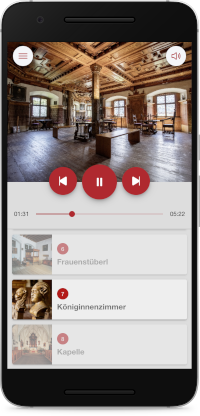
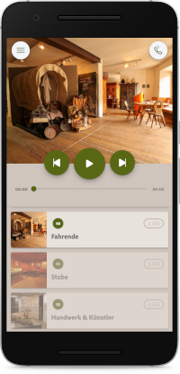
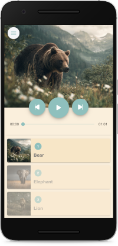

  

 

---

SmartCompanion is a free and open-source Progressive Web App (PWA) that delivers interactive audioguide experiences for museums and cultural institutions. It runs seamlessly in any modern mobile browser — no installation required.

The app is fully customizable, allowing you to adapt content, colors, text, and images to fit your institution’s needs. It also includes offline functionality powered by a service worker, ensuring smooth use even without an internet connection.

## Examples

| [Castle Tratzberg](https://www.smartcompanion.app/projects/mobile-apps/schloss-tratzberg/) | [Museum Landeck](https://www.smartcompanion.app/projects/mobile-apps/schloss-landeck/) | [Example App](https://smartcompanion-audioguide-app.netlify.app) |
|---|---|---| 
|  |  |  |

## Installation

 - Fork and clone the repo
 - Install all dependencies with `npm install`
 - Either build the project with `npm build` or open a live preview within the browser with `npm start`

## Deployment Options

| Service | Description |
|---|---|
| [Netlify](https://www.netlify.com/) | The [Example App](https://smartcompanion-audioguide-app.netlify.app) is hosted on Netlify. Netlify offers a free option and supports custom domain. |
| [Github Pages](https://docs.github.com/en/pages/quickstart) | Github Pages offers a free option for open source repositories and supports custom domains. |
| [SmartCompanion](https://www.smartcompanion.app/) | We offer a hosting service including a content management system, continous updates and security fixes, custom domains and support. |

## Customization

### App Content

The content is loaded from a `data.json` file, which contains all texts and references to assets like images and audio files. Inside the `stencil.config.ts` the `DATA_URL` should point to your `data.json` file. The sample data, which is used for the demo of the app can be found [here](https://github.com/smartcompanion-app/sample-data/tree/main/animals). Custom data needs to be structured according to the example.

### App Appearance

#### App Colors

 - scss color variables in `src/global/app.scss`
 - background_color and theme_color in `manifest.json`
 - theme_color in `index.html`

#### Text

 - title and description in `index.html`
 - title in `stencil.config.ts`

#### Images

  - `logo.png` in `assets` folder
  - `favicon.ico` and `icon.png` in `assets/icon` folder

### Offline Support

The PWA can be used with offline support with a service worker. When using a service work the initial startup of the app takes a bit longer, since all relevant files need to be downloaded and cached. Inside the `stencil.config.ts` file `OFFLINE_SUPPORT` can be set to `true` or `false`.

## License

The SmartCompanion Audioguide App is licensed under the terms of the BSD 2-Clause license. Check the [LICENSE](LICENSE) text for further details.

## Links

- [Web site](https://www.smartcompanion.app)
- [Native Audio Capacitor Plugin](https://github.com/smartcompanion-app/native-audio-player)
