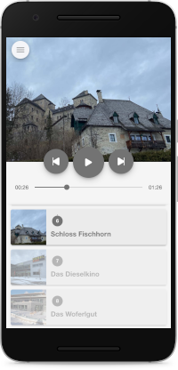

<div align="center">
  
</div>

---

The SmartCompanion Audioguide App is a free and open-source Progressive Web App (PWA) that delivers interactive audioguide experiences for museums and cultural institutions. It runs seamlessly in any modern mobile browser — no installation required.

The app is fully customizable, allowing you to adapt content, colors, text, and images to fit your institution's needs. It also includes offline functionality powered by a service worker, ensuring smooth use even without an internet connection.

## Features

- 🎧 **Interactive Audioguide** — station-based audio playback for museum tours
- 📱 **Progressive Web App** — works in any modern browser, no app store needed
- 🌐 **Multilingual** — built-in i18n support for multiple languages
- 📶 **Offline Support** — optional service worker caching for use without internet
- 🎨 **Fully Customizable** — adapt colors, content, images, and branding
- ⚡ **Lightweight** — built with Stencil.js and Ionic for fast performance
- 🆓 **Open Source** — BSD 2-Clause license

## Examples

| [Castle Tratzberg](https://www.smartcompanion.app/projects/mobile-apps/schloss-tratzberg/) | [Museum Landeck](https://www.smartcompanion.app/projects/mobile-apps/schloss-landeck/) | [Example App (Animals)](https://smartcompanion-app.github.io/audioguide-app/animals) | [Example App (Leon)](https://smartcompanion-app.github.io/audioguide-app/leon) |
|---|---|---|---|
|  |  |  |  |

## Installation & Development

- Fork and clone the repo
- Install all dependencies with `npm install`
- Either build the project with `npm run build` or open a live preview within the browser with `npm start`

```bash
npm start          # Dev server with hot reload
npm run build      # Production build → www/
npm test           # Run spec & e2e tests
npm run test:dev   # Continuous test watching
```

## Deployment Options

| Service | Description |
|---|---|
| [SmartCompanion](https://www.smartcompanion.app/) | We offer a hosting service including a content management system, continuous updates, security fixes, custom domains, support and further services. |
| [GitHub Pages](https://docs.github.com/en/pages/quickstart) | GitHub Pages offers a free option for open source repositories and supports custom domains. The example apps are hosted on GitHub Pages. |
| [Netlify](https://www.netlify.com/) | Netlify offers a free option and supports custom domains also for private GitHub repositories. |

## Customization

Customization is handled via [engraft](https://github.com/smartcompanion-app/engraft) using the `engraft.template.yml` file. All configurable variables are listed below:

| Variable | Description | Default |
|---|---|---|
| `title_short` | Short app title | `Animals` |
| `title` | App title | `Animals Audioguide` |
| `description` | App description | `A sample audioguide app for animals` |
| `lang` | Language code for manifest.json | `en` |
| `data_url` | URL to the audioguide data JSON | [Sample JSON](https://smartcompanion-app.github.io/data-format/animals/data.json) |
| `offline_support` | Enable offline support (true/false) | `false` |
| `messaging_support` | Enable postMessage listener for iframe embedding (true/false) | `true` |
| `background_color` | App background color | `#faefdc` |
| `card_background_color` | Card background color | `#f7e6c7` |
| `station_icon_progress_color` | Station icon progress color | `#305653` |
| `menu_border_color` | Menu item border color | `#f4dcb3` |
| `primary_color` | Primary brand color | `#8fc0bd` |
| `primary_color_contrast` | Text color on primary color | `#ffffff` |
| `primary_color_shade` | Darker shade of primary color | `#7ea9a6` |
| `primary_color_tint` | Lighter tint of primary color | `#9ac6c4` |
| `logo` | Path to app logo image | `src/assets/logo.png` |
| `favicon` | Path to favicon file | `src/assets/icon/favicon.ico` |
| `icon_192` | Path to 192x192 PWA icon | `src/assets/icon/icon-192.png` |
| `icon_512` | Path to 512x512 PWA icon | `src/assets/icon/icon-512.png` |

For `primary_color_shade` and `primary_color_tint`, use the [Ionic Color Creator](https://ionicframework.com/docs/theming/colors#new-color-creator) to calculate matching values.

## Contributing

Contributions are welcome! Feel free to open issues or submit pull requests.

## License

The SmartCompanion Audioguide App is licensed under the terms of the BSD 2-Clause license. Check the [LICENSE](LICENSE) file for further details.

## Links

- [Website](https://www.smartcompanion.app)
- [Native Audio Capacitor Plugin](https://github.com/smartcompanion-app/native-audio-player)