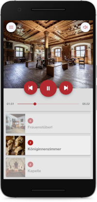
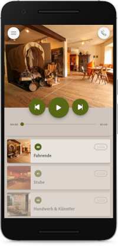
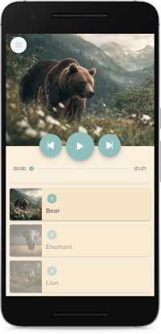

<div align="center">
  
</div>

---

The SmartCompanion Audioguide App is a free and open-source Progressive Web App (PWA) that delivers interactive audioguide experiences for museums and cultural institutions. It runs seamlessly in any modern mobile browser — no installation required.

The app is fully customizable, allowing you to adapt content, colors, text, and images to fit your institution's needs. It also includes offline functionality powered by a service worker, ensuring smooth use even without an internet connection.

## Features

- 🎧 **Interactive Audioguide** — station-based audio playback for museum tours
- 📱 **Progressive Web App** — works in any modern browser, no app store needed
- 🌐 **Multilingual** — built-in i18n support for multiple languages
- 📶 **Offline Support** — optional service worker caching for use without internet
- 🎨 **Fully Customizable** — adapt colors, content, images, and branding
- ⚡ **Lightweight** — built with Stencil.js and Ionic for fast performance
- 🆓 **Open Source** — BSD 2-Clause license

## Examples

| [Castle Tratzberg](https://www.smartcompanion.app/projects/mobile-apps/schloss-tratzberg/) | [Museum Landeck](https://www.smartcompanion.app/projects/mobile-apps/schloss-landeck/) | [Example App](https://smartcompanion-audioguide-app.netlify.app) |
|---|---|---|
|  |  |  |

## Installation

- Fork and clone the repo
- Install all dependencies with `npm install`
- Either build the project with `npm run build` or open a live preview within the browser with `npm start`

## Development

```bash
npm start          # Dev server with hot reload
npm run build      # Production build → www/
npm test           # Run spec & e2e tests
npm run test:dev   # Continuous test watching
```

## Deployment Options

| Service | Description |
|---|---|
| [Netlify](https://www.netlify.com/) | The [Example App](https://smartcompanion-audioguide-app.netlify.app) is hosted on Netlify. Netlify offers a free option and supports custom domains. |
| [GitHub Pages](https://docs.github.com/en/pages/quickstart) | GitHub Pages offers a free option for open source repositories and supports custom domains. |
| [SmartCompanion](https://www.smartcompanion.app/) | We offer a hosting service including a content management system, continuous updates and security fixes, custom domains, and support. |

## Customization

### App Content

The content is loaded from a `data.json` file, which contains all texts and references to assets like images and audio files. Inside the `stencil.config.ts` the `DATA_URL` should point to your `data.json` file. The sample data, which is used for the demo of the app, can be found [here](https://github.com/smartcompanion-app/sample-data/tree/main/animals). Custom data needs to be structured according to the example.

### App Appearance

#### App Colors

- SCSS color variables in `src/global/app.scss` (CSS custom properties with `--sc-` prefix)
- `background_color` and `theme_color` in `manifest.json`
- `theme_color` in `index.html`

#### Text

- Title and description in `index.html`
- Title in `stencil.config.ts` (`Env.TITLE`)
- `name`, `short_name` and `description` in the `manifest.json`

#### Images

- `logo.png` in `assets` folder
- `favicon.ico`, `icon-192.png`, `icon-512.png` in `assets/icon` folder

### Offline Support

The PWA can be used with offline support via a service worker. When using a service worker, the initial startup of the app takes a bit longer since all relevant files need to be downloaded and cached. Inside the `stencil.config.ts` file, set `OFFLINE_SUPPORT` to `"enabled"` or `"disabled"`.

## Contributing

Contributions are welcome! Feel free to open issues or submit pull requests.

## License

The SmartCompanion Audioguide App is licensed under the terms of the BSD 2-Clause license. Check the [LICENSE](LICENSE) file for further details.

## Links

- [Website](https://www.smartcompanion.app)
- [Native Audio Capacitor Plugin](https://github.com/smartcompanion-app/native-audio-player)