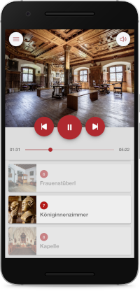
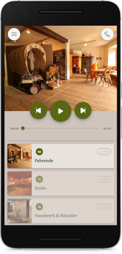
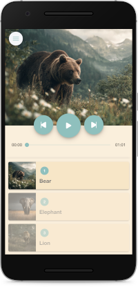
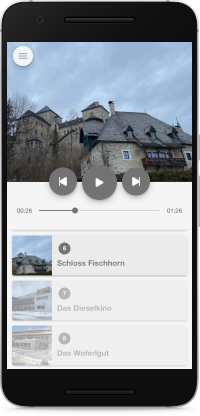

<div align="center">
  
</div>

---

The SmartCompanion Audioguide App is a free and open-source Progressive Web App (PWA) that delivers interactive audioguide experiences for museums and cultural institutions. It runs seamlessly in any modern mobile browser — no installation required.

The app is fully customizable, allowing you to adapt content, colors, text, and images to fit your institution's needs. It also includes offline functionality powered by a service worker, ensuring smooth use even without an internet connection.

## Features

- 🎧 **Interactive Audioguide** — station-based audio playback for museum tours
- 📱 **Progressive Web App** — works in any modern browser, no app store needed
- 🌐 **Multilingual** — built-in i18n support for multiple languages
- 📶 **Offline Support** — optional service worker caching for use without internet
- 🎨 **Fully Customizable** — adapt colors, content, images, and branding
- 🌗 **Light & Dark Mode** — automatically follows the user's system preference
- ⚡ **Lightweight** — built with Stencil.js and Ionic for fast performance
- 🆓 **Open Source** — BSD 2-Clause license

## Examples

| [Castle Tratzberg](https://www.smartcompanion.app/projects/mobile-apps/schloss-tratzberg/) | [Museum Landeck](https://www.smartcompanion.app/projects/mobile-apps/schloss-landeck/) | [Example App (Animals)](https://smartcompanion-app.github.io/audioguide-app/animals) | [Example App (Leon)](https://smartcompanion-app.github.io/audioguide-app/leon) |
|---|---|---|---|
|  |  |  |  |

## Browser Support

Visitor devices need **Chrome/Edge 110+, Safari 16.4+ (iOS 16.4+), or Firefox 110+**. The station list and image slideshow are built on swiper 14, which sets this floor. If you need to support older devices, stay on a release before `@smartcompanion/ui` 1.0.0.

## Installation & Development

- Fork and clone the repo
- Install all dependencies with `npm install`
- Either build the project with `npm run build` or open a live preview within the browser with `npm start`

```bash
npm start          # Dev server with hot reload
npm run build      # Production build → www/
npm test           # Run spec & e2e tests
npm run test:dev   # Continuous test watching
```

## Deployment Options

| Service | Description |
|---|---|
| [SmartCompanion](https://www.smartcompanion.app/) | We offer a hosting service including a content management system, continuous updates, security fixes, custom domains, support and further services. |
| [GitHub Pages](https://docs.github.com/en/pages/quickstart) | GitHub Pages offers a free option for open source repositories and supports custom domains. The example apps are hosted on GitHub Pages. |
| [Netlify](https://www.netlify.com/) | Netlify offers a free option and supports custom domains also for private GitHub repositories. |

## Customization

Customization is handled via [engraft](https://github.com/smartcompanion-app/engraft), which is included as the `@smartcompanion/engraft` devDependency. After `npm install`, apply a values file with:

```bash
npx engraft apply --template engraft.template.yml --values customization/leon/engraft.variables.yml
```

A ready-to-use example lives in [`customization/leon/`](customization/leon/) — copy that directory to start your own variant. All configurable variables defined in `engraft.template.yml` are listed below:

| Variable | Description | Default |
|---|---|---|
| `title_short` | Short app title | `Animals` |
| `title` | App title | `Animals Audioguide` |
| `description` | App description | `A sample audioguide app for animals` |
| `lang` | Language code for manifest.json | `en` |
| `data_url` | URL to the audioguide data JSON | [Sample JSON](https://smartcompanion-app.github.io/data-format/animals/data.json) |
| `offline_support` | Enable offline support (true/false) | `false` |
| `messaging_support` | Enable postMessage listener for iframe embedding (true/false) | `true` |
| `background_color` | App background color | `#faefdc` |
| `primary_color` | Primary brand color | `#8fc0bd` |
| `primary_color_contrast` | Text color on primary color | `#ffffff` |
| `logo` | Path to app logo image | `src/assets/logo.png` |
| `logo_dark` | Path to app logo image (dark mode) | `src/assets/logo-dark.png` |
| `favicon` | Path to favicon file | `src/assets/icon/favicon.ico` |
| `icon_192` | Path to 192x192 PWA icon | `src/assets/icon/icon-192.png` |
| `icon_512` | Path to 512x512 PWA icon | `src/assets/icon/icon-512.png` |

### Colors

An app names two colors — `background_color` and `primary_color` — and the rest of the palette is computed from them at build time by [`src/global/_color-helpers.scss`](src/global/_color-helpers.scss). Surfaces step off the background (darker in light mode, lighter in dark mode), the dark palette is the light background at low lightness, and shades and tints match the [Ionic Color Creator](https://ionicframework.com/docs/theming/colors#new-color-creator) exactly.

Every derived color can still be set explicitly. These variables have no default — name one in your values file and it wins, leave it out and it is derived:

| Variable | Description | Derived from |
|---|---|---|
| `background_color_dark` | App background color (dark mode) | `background_color`, same hue at 11% lightness |
| `card_background_color` | Card background color | `background_color`, one step off it |
| `card_background_color_dark` | Card background color (dark mode) | `background_color_dark`, one step off it |
| `menu_border_color` | Menu item border color | `background_color`, two steps off it |
| `menu_border_color_dark` | Menu item border color (dark mode) | `background_color_dark`, two steps off it |
| `station_icon_progress_color` | Station icon progress color | `primary_color`, pushed away from the background |
| `station_icon_progress_color_dark` | Station icon progress color (dark mode) | `primary_color`, pushed away from the dark background |
| `light_color` | Ionic's `light` color | `background_color` |
| `light_color_dark` | Ionic's `light` color (dark mode) | `background_color_dark` |

`primary_color_contrast` is the one color that is not derived: the same rule Ionic uses resolves the default primary to black text, so which text color sits on a brand color stays a design decision.

The `theme-color` meta tags in `index.html` are the light background at build time and are kept on the active background color at runtime by `src/global/app.ts`, so they follow both the system palette and a palette forced with `UPDATE_DARK_MODE`.

## Releases

Releases are managed with [changesets](https://github.com/changesets/changesets) and versioned as `YYYY.MINOR.MICRO` — the [CalVer](https://calver.org/) scheme PyCharm and Unity use. This is a deployed application, not a library, so a version says when a build is from rather than what it promises about an API.

### Versioning

The year is the only calendar claim; `MINOR` and `MICRO` are plain sequences within it:

```
2026.1.0 → 2026.1.1 → 2026.2.0 → … → 2027.0.0
```

Because the scheme is CalVer rather than semver, the bump levels mean something different from usual:

| Bump | Meaning |
|---|---|
| `major` | a new calendar year — used once a year, nothing else |
| `minor` | new features, and anything that breaks a fork's customization |
| `patch` | fixes, dependency bumps, internal changes |

Breaking changes are therefore described in the changelog rather than signalled by the version. That is deliberate: if you maintain a customized fork, "the engraft variable `x` was renamed to `y`" is something you can act on, whereas an incremented number is not.

The release workflow checks that a release's year matches the current one, so the year cannot quietly fall behind if a major changeset is forgotten.

### Making a change

Add a changeset to any pull request that changes behaviour:

```bash
npx changeset
```

Pick a bump level and describe the change for the people who will read the release notes. Changesets collects these into a `chore: release` pull request; merging it applies the version, updates `CHANGELOG.md`, tags, and creates the GitHub release — which in turn builds every app variant and deploys them to GitHub Pages.

### Identifying a build

The version is stamped into each build as a `version` meta tag, which is the quickest way to tell which build a device is actually running:

```js
document.querySelector('meta[name="version"]').content; // "2026.1.0"
```

Local builds report `dev`.

To roll back, run the `release` workflow manually (**Actions → release → Run workflow**) and give it the tag to redeploy. This rebuilds from that tag rather than re-serving a stored artifact, and browsers holding a cached service worker pick the change up on their next activation — so it is a fix-forward lever, not an instant kill switch.

## Contributing

Contributions are welcome! Feel free to open issues or submit pull requests.

## License

The SmartCompanion Audioguide App is licensed under the terms of the BSD 2-Clause license. Check the [LICENSE](LICENSE) file for further details.

## Links

- [Website](https://www.smartcompanion.app)
- [Native Audio Capacitor Plugin](https://github.com/smartcompanion-app/native-audio-player)